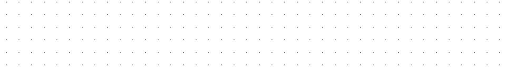

# Supernote blank page templates

On finding that my old Supernote Nomad templates were no good for the Supernote Manta, and not finding what I needed online, I decided to create my own.  These templates are created with a ruby script that uses the ruby [cairo](https://github.com/rcairo/rcairo) gem.

The script currently generates files optimised for the Supernote Manta (1920 * 2560) and Nomad (1404 x 1872).

The templates are generated in a range of sizes from 2mm spacing to 10mm spacing.

**Please note that the greys you see on screen are not completely representative of what you see on the device**

## Download the collection (zip of all variants)
**Right-click and "Save link as..."**
- [Manta](./downloads/manta_1_0.zip)
- [Nomad](./downloads/nomad_1_0.zip)
- [Both devices](./downloads/all_devices_1_0.zip) (Non-conflicting filenames for synced devices)

## Previews
The following styles are included:

### Dot grid

### Dot grid white

### Dot grid white (darker variant)

### Grid

### Grid white

### Grid white (darker variant)

### Lines

### Lines white

### Lines white (darker variant)

## Development notes
This is in no way production quality code, don't judge me on it.
